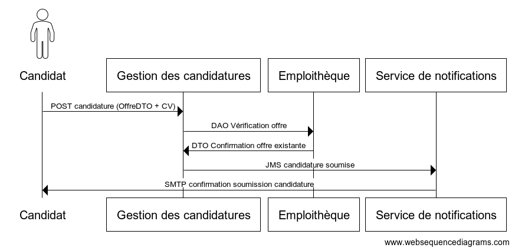
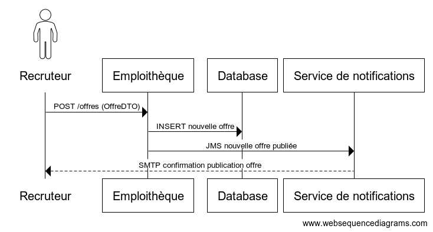
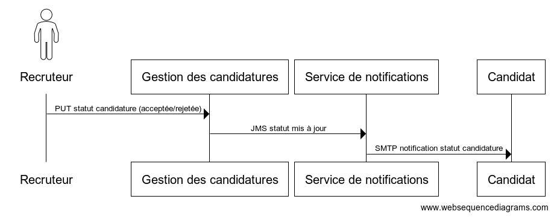

# Acteurs :
<ul>
<li>Candidat : Cherche des emplois et postule aux offres. </li>
<li>Employeur : Publie des offres et gère les candidatures. </li>
</ul>

# Objectifs du système à modéliser :

On propose de modéliser un système d'aide à la recherche d'emplois, mettant en relation les recruteurs et les candidats et de mise en relation des candidats et des employeurs pour faciliter la recherche d’emplois et le suivi des candidatures. Le système permet également d’envoyer des recommandations personnalisées aux candidats basées sur leur CV et les offres disponibles.

## Le projet inclut :
<ul>
<li>Service de gestion des candidatures.</li>
<li>Service de gestion des CV (CVThèque). </li>
<li>Service de gestion des offres d’emploi (Emploithèque). </li>
<li>Service d’envoi des notifications (statut des candidatures, offres pertinentes). </li>

## Exigences fonctionnelles : 

#### Candidat

- Consulter les offres d’emploi disponibles.
- Postuler à une ou plusieurs offres d’emploi.
- Recevoir des recommandations d’offres personnalisées en fonction de son CV.
- Suivre le statut de ses candidatures (en cours, instruite, rejetée, acceptée pour entretien).
- Recevoir des notifications par email concernant des offres pertinentes ou la mise à jour du statut d’une candidature.

#### Recruteur
- Publier des offres d’emploi.
- Consulter et gérer les candidatures reçues (modifier le statut : en cours, rejetée, acceptée).
- Supprimer une offre d’emploi.

## Règles métier
- Le candidat reçoit des recommandations personnalisées en fonction de son CV et des offres disponibles dans l'emploithèque.
- La gestion des candidatures permet à un candidat de postuler et à un employeur de suivre l'évolution des candidatures.
- Lors de la mise à jour du statut d'une candidature, une notification est envoyée au candidat par email.
- La CVThèque envoie par email les offres pertinentes aux candidats.

# Diagrammes de séquences :

#### Processus de candidature :
    

    
#### Publication d'une offre :
    

#### Mise à jour d'une offre :
    

    
#### Recommandation des offres au candidat :
    

    