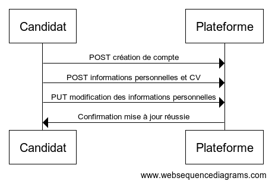
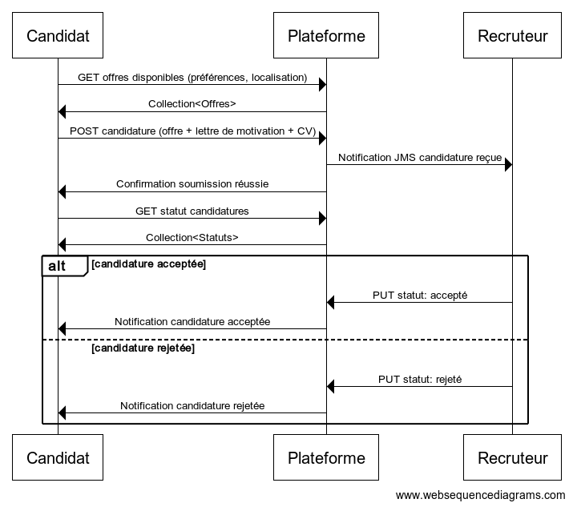
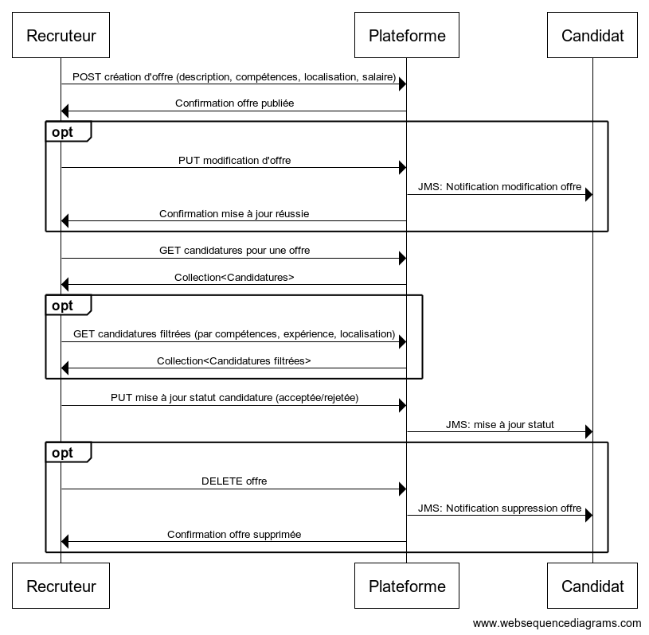
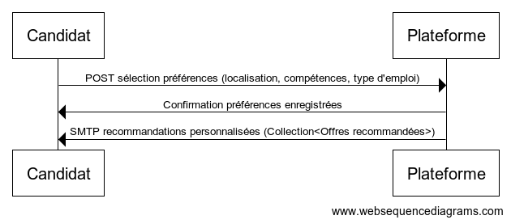
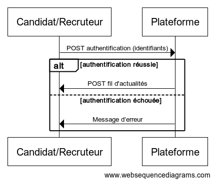

# Objectifs du système à modéliser :

On propose de modéliser un système d'aide à la recherche d'emplois, mettant en relation les recruteurs et les candidats.
Le système gère les offres d’emploi publiées par les recruteurs, les profils des candidats et les candidatures. Il propose également une fonctionnalité pour suivre les recommandations personnalisées pour les candidats et les recruteurs.

Le candidat commence par créer un compte sur la plateforme, où il renseigne ses informations personnelles, ses compétences, et télécharge son CV. Une fois son profil complété, il consulte les offres d’emploi disponibles via l’API REST, en fonction de ses préférences (localisation, compétences, etc.). Il sélectionne une offre qui l’intéresse et soumet sa candidature en ajoutant une lettre de motivation. La candidature est ensuite transmise au recruteur via la plateforme.
Le recruteur, peut publier des offres d’emploi en indiquant les détails nécessaires (poste, compétences requises, localisation, salaire). Lorsque des candidatures sont reçues, il interroge la plateforme pour examiner les profils des candidats. Après analyse, le recruteur met à jour le statut de la candidature (acceptée, rejetée ou en attente d’entretien), et le candidat est immédiatement notifié via l’API REST. En cas de suppression de l’offre par le recruteur, la plateforme informe automatiquement les candidats concernés.

# Exigences fonctionnelles : 

#### Candidat : 
        - Un candidat DOIT pouvoir créer et modifier son profil avec des informations telles que son nom, ses compétences, son expérience, son CV et une lettre de motivation.
        - Un candidat DOIT pouvoir consulter les offres d’emploi disponibles en fonction de ses préférences et de sa localisation.
        - Un candidat DOIT pouvoir postuler à une ou plusieurs offres en soumettant les documents nécessaires via l’interface.
        - Un candidat DOIT pouvoir suivre le statut de ses candidatures (en attente, accepté, rejeté).
        - Un candidat DOIT pouvoir recevoir des notifications en cas de mise à jour du statut de ses candidatures ou en cas de suppression d’une offre à laquelle il a postulé.
        - Un candidat DOIT pouvoir recevoir des recommandations d’offres personnalisées en fonction de ses compétences
#### Recruteur :
        - Un recruteur DOIT pouvoir créer, modifier et supprimer des offres d’emploi, incluant des détails tels que la description du poste, les compétences requises, la localisation, et le salaire.
        - Un recruteur DOIT pouvoir consulter les candidatures reçues pour une offre spécifique.
        - Un recruteur DOIT pouvoir filtrer les candidatures en fonction de critères tels que l’expérience, les compétences, ou la localisation.
        - Un recruteur DOIT pouvoir mettre à jour le statut d’une candidature (en attente, accepté, rejeté).
#### Système : 
        - Le système DOIT gérer l’envoi de notifications aux utilisateurs en cas de mise à jour ou de suppression d’offres.
        - Le système DOIT offrir un service de recommandation (basé sur leurs préférences) pour les candidats .
        - Le système DOIT permettre la gestion des autorisations pour sécuriser l’accès.

# Diagrammes de séquences :

#### Création compte candidat :

#### Processus de candidature :
    

    
#### Processus de recrutement :
    

    
#### Recommandation des offres au candidat :
    

    
#### Process de connexion : 
    
